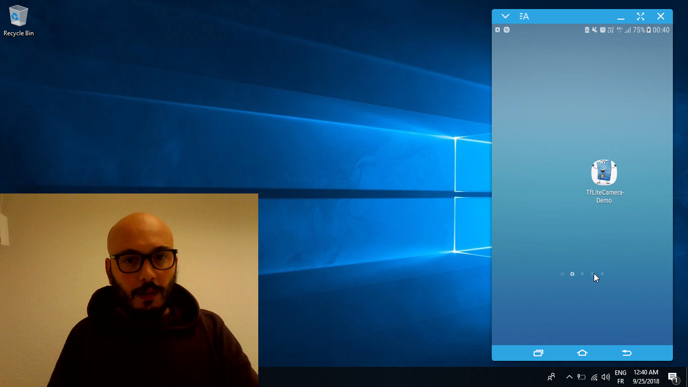

# document-classification-app
This project is about classifying documents into categories using CNNs

## Demo

[](https://youtu.be/lUGVvi3ZRrg)

##  goals

Be able to classify documents in different categories in real time. 

##  materiels

### Hardware

* Packard Bell easy note Pc running Windows 10. 
* CPU  =  2.3 Ghz
* RAM  = 4 Go
* HDD  = 500 GB 

### Sotware

- `python3` as programming language

- `tensorflow lite` a mobile version of the great tensorflow 

- `Android` a mobile framework for programming mobile apps 

## Installation

### Download github repository

```shell
https://github.com/deepKratos/document-classification-app.git
```

### Create virtual environement

- Windows users

```shell
python -m venv myenv # creates a virtual environement
cd myenv\Scripts # change folder
.\activate # activate environement
```

- Linux users

```shell
python -m venv myenv # creates a virtual environement 
cd myenv\bin # change folder
source activate # activate environement  
```

### Prepare environement / Install dependencies

```shell
pip install tensorflow
pip install numpy
pip install matplotlib
```

## Run the code

To execute the code:

`TODO`

## I'll open Source it as soon i finish with the android app . Keep in touch 

## Author

- **Hichem MAIZA**

## Acknoldgement*

*  **Google** for tensorflow & android 
*  **Andrew Ng** for his great courses
*  **Siraj Raval** for his motivational videos
